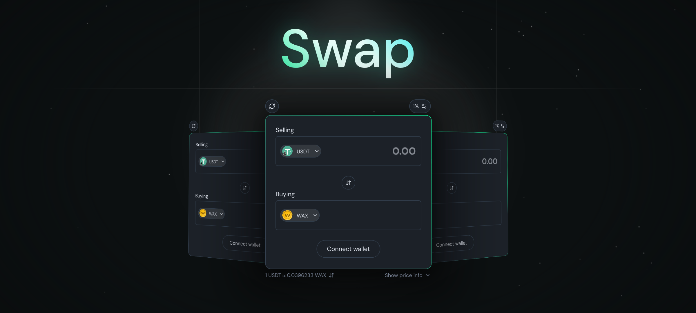

# WaxOnEdge Swap



The world's most powerful swap component powered by WaxOnEdge + NeftyBlocks.

[](https://www.npmjs.org/package/@waxonedge/swap)
[](https://www.npmjs.org/package/@waxonedge/swap)
[](https://www.npmjs.org/package/@waxonedge/swap)

> ⚠️ This component is still in development and we will change how it works until we have hit a stable V1.0.0.

# Project Structure

the root of this project is for development of the swap component. the source code is in the `swap` folder. [swap readme](./swap/README.md)

# Development

1. Install packages:

```bash
    $ pnpm i
```

2. Run develop:

```bash
    $ pnpm dev
```

go to [localhost:5173](http://localhost:5173/)

3. Build the library:
   this will build two versions: the swap with vue embedded and the swap without.

```bash
    $ pnpm build
```

# Publish

publishing to npm is done through GitHub actions, create a new tag with the last version and push it.

```bash
    $ git tag v0.0.0

    $ git push origin v0.0.0
```
